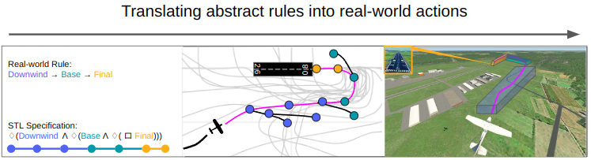

# Follow The Rules: Online Signal Temporal Logic Tree Search for Guided Imitation Learning in Stochastic Domains

This repository contains the code for the paper submitted to ICRA 2023. 

[**Follow The Rules: Online Signal Temporal Logic Tree Search for Guided Imitation Learning in Stochastic Domains**](https://arxiv.org/abs/) 

[Jasmine Jerry Aloor*](https://jaroan.github.io/jasminejerrya/), [Jay Patrikar*](https://jaypatrikar.me/), [Parv Kapoor](https://bradymoon.com/), [Jean Oh](https://www.cs.cmu.edu/~./jeanoh/) and [Sebastian Scherer](https://www.ri.cmu.edu/ri-faculty/sebastian-scherer/).

*equal contribution

## Brief Overview [[Video]](https://youtu.be/fiFCwc57MQs)



Seamlessly integrating rules in Learning-from-Demonstrations (LfD) policies is a critical requirement to enable the real-world deployment of AI agents.
Recently Signal Temporal Logic (STL) has been shown to be an effective language for encoding rules as spatio-temporal constraints. 
This work uses Monte Carlo Tree Search (MCTS) as a means of integrating STL specification into a vanilla LfD policy to improve constraint satisfaction. We propose augmenting the MCTS heuristic with STL robustness values to bias the tree search towards branches with higher constraint satisfaction. While the domain-independent method can be applied to integrate STL rules online into any pre-trained LfD algorithm, we choose goal-conditioned Generative Adversarial Imitation Learning as the offline LfD policy. We apply the proposed method to the domain of planning trajectories for General Aviation aircraft around a non-towered airfield. Results using the simulator trained on real-world data showcase 60\% improved performance over baseline LfD methods that do not use STL heuristics.

## Installation
### Environment Setup

First, we'll create a conda environment to hold the dependencies.

```
conda create --name stlmcts --file requirements.txt
conda activate stlmcts
```

### Data Setup

The network uses [TrajAir Dataset](https://theairlab.org/trajair/).

```
cd dataset
wget https://kilthub.cmu.edu/ndownloader/articles/14866251/versions/1
```

Unzip dataset files in place as shown in the folder tree below.

```
mcts-stl-planning/
├─ dataset/
│  ├─ 111_days/
│  │  ├─ processed_data/
│  │  │  ├─ test/
│  │  │  ├─ train/
├─ episodes/
├─ gym/
├─ images/
├─ mcts/
├─ model/
├─ rtamt/
├─ saved_models/
├─ costmap.py
├─ play.py
```

## MCTS Parameters

The MCTS is implemented as a recursive function where each iteration ends with a new leaf that corresponds to an action in the trajectory library.  For running the algorithm, we can choose any dataset. 
For example, to test with Behavior Cloning algorithm (BC) with 111_days use: 

`python play.py --dataset_name 111_days --algo BC --tcn_channel_size 256`

To test with goalGAIL algorithm (goalGAIL) with 111_days use: 

`python play.py --dataset_name 111_days --algo GAIL --tcn_channel_size 512`

- `--checkpoint` Argument to set checkpoint for MCTS (default = `/episodes/`)
- `--load_episodes` Argument to load episodes (default = `False`)
- `--algo` Baseline algorithm for network (default = `BC`)

- `--numMCTS` Number of MCTS Trees (default = `50`)
- `--cpuct` Argument to balance the exploration and exploitation (default = `1`)
- `--huct` Weight of heuristic  (default = `4000`)
- `--parallel` Argument to set parallel execution (default = `False`)
- `--num_process` Number of processes (default = `1000`)
- `--algo` Baseline algorithm for network (default = `BC`)

- `--numEpisodeSteps` Number of steps in an episode (default = `30`)
- `--maxlenOfQueue` Maximim length of queue (default = `25600`)
- `--numEps` Maximum number of episodes  (default = `100`)
- `--numEpsTest` Maximum number of episodes  during testing (default = `100`)
- `--numIters` Number of iterations (default = `1`) !!review
- `--plot` To plot the trees (default = `False`)

## Inititalization Network

### Model Training

For training data we can choose between the 4 training subsets of data labelled 7days1, 7days1, 7days1, 7days1 or the entire dataset 111_days. For example, to train with 7days1 use: 

`python train.py --dataset_name 7days1`

Training will use GPUs if available.

Optional arguments can be given as following:

- `--dataset_folder` sets the working directory for data. Default is current working directory (default = `/dataset/`). 
- `--dataset_name` sets the data block to use (default = `111_days`).
- `--models_folder` sets the directory for saved model. Default is saved_models directory (default = `/saved_models/`). 
- `--model_weights` sets the model weight to be used (default = `model_111_days_4.pt`). !! Needs review
- `--obs` observation length (default = `11`).
- `--preds` prediction length (default = `120`).
- `--preds_step` prediction steps (default = `5`).
- `--delim` Delimiter used in data (default = ` `).
- `--use_trajair` Option to use trajairnet model(default = ` False`). !! needs review

- `--algo` Baseline algorithm for network (default = `BC`)
- `--total_epochs` Total number passes over the entire training data set (default = `10`).
<!-- - `--evaluate` Test the model at every epoch (default = `True`). -->
<!-- - `--save_model` Save the model at every epoch (default = `True`). -->
- `--model_pth` Path to save the models (default = `/saved_models/`).

#### TCN Network Arguments

- `--input_channels` The number of input channels (x,y,z) (default = `3`).
- `--tcn_kernels` The size of the kernel to use in each convolutional layer (default = `4`).
- `--tcn_channel_size` The number of hidden units to use (default = `512`).
- `--tcn_layers` The number of layers to use. (default = `2`)
- `--mlp_layer`  The number of hidden units in the MLP decoder (default, BC = `91`, goalGAIL = ).

#### Model Testing

<!-- `python test.py --dataset_name 7days1 --epoch 1` -->

<!-- Optional arguments can be given as following: -->

- `--dataset_folder` sets the working directory for data. Default is current working directory (default = `/dataset/`). 
- `--dataset_name` sets the data block to use (default = `7days1`).
- `--obs` observation length (default = `11`).
- `--preds` prediction length (default = `120`).
- `--preds_step` prediction steps (default = `10`).
- `--delim` Delimiter used in data (default = ` `).
- `--model_dir` Path to load the models (default = `/saved_models/`).
- `--epoch` Epoch to load the model. 


## STL Library: RTAMT

To install the RTAMT library for monitoring of Signal Temporal Logic (STL) [rtamt](https://github.com/nickovic/rtamt) follow the package's [installation procedure](https://github.com/nickovic/rtamt#installation)

Additionally, if the antlr4 dependency throws an error, follow the [conda installation here](https://anaconda.org/conda-forge/antlr4-python3-runtime)

## TrajAir Dataset

More information about TrajAir dataset is avaiable at [link](https://theairlab.org/trajair/).

## Cite
If you have any questions, please contact [jaypat@cmu.edu](mailto:jaypat@cmu.edu) or open an issue on this repo. 

If you find this repository useful for your research, please cite the following paper:

```
@misc{arxiv upload,
      title={Follow The Rules: Online Signal Temporal Logic Tree Search for Guided Imitation Learning in Stochastic Domains}, 
      author={Jasmine Jerry Aloor and Jay Patrikar and Parv Kapoor and Jean Oh and Sebastian Scherer},
      year={2022},
      eprint={ },
      archivePrefix={arXiv},
      primaryClass={cs.RO}
}
```
